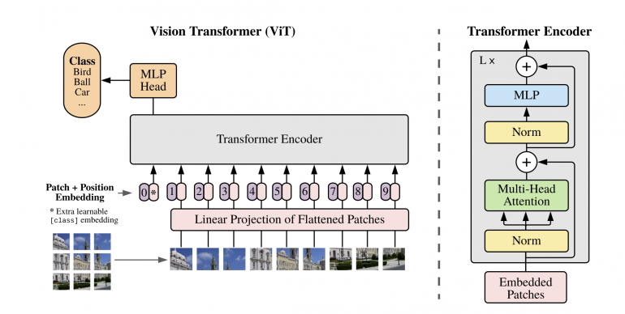

---

<div align="center">    
 
# TRES-Net   

[](https://arxiv.org/abs/2006.03677)

<!--
ARXIV   
[](https://arxiv.org/abs/2006.03677)
-->


</div>
 
## Description   
This is an implementation of a visual transformer.
I used resneSt(50-101-152) as backbone to extract feature maps and tokens from the images.
The model converges very fast and reaches reasonable accuracy(95%++) on most publicly available small-medium datasets.



## How to run   

First, install dependencies   
```bash
# clone project   
git clone https://github.com/Zyarra/Visual_transformer

# install project
pip install -r requirements.txt
 ```   
 ### Edit hyperparameters in hyperparameters.py, I will add argparse soon..
 ### Or just add your dataset in the same file in 'DATA_DIR' and run main.py
 ### The script will run until it converges and stops when the validation loss stops increasing. This should be within 10 epoch for most datasets.


 

